# CT Validation: Wiring Diagram Metatheory on PlanetMath Category Theory

Classical baseline for 313 PlanetMath category theory entries, cross-referenced
with 137 nLab bridge concepts. Validates the wiring diagram metatheory (v3.0)
by comparing how the same mathematical concept is wired differently across sources.

## Functor Category: PM vs nLab Wiring

```mermaid
---
config:
  theme: base
  themeVariables:
    fontSize: 13px
---
block-beta
columns 2

block:PM["PlanetMath — ratio 2:1 (reference)"]:1
  columns 1
  pm_header["19 components · 10 wires · 2 ports"]
  style pm_header fill:#DBEAFE,stroke:#2563EB,color:#1e40af
end

block:NL["nLab — ratio 1:3 (tutorial)"]:1
  columns 1
  nl_header["8 components · 22 wires · 3 ports"]
  style nl_header fill:#DCFCE7,stroke:#16A34A,color:#166534
end
```

### PlanetMath: definition-dense, wire-sparse

```mermaid
flowchart TD
    classDef comp fill:#DBEAFE,stroke:#2563EB,color:#1e40af,font-weight:bold
    classDef suchthat fill:#E0E7FF,stroke:#4F46E5,color:#3730a3
    classDef quant fill:#BFDBFE,stroke:#2563EB,color:#1e40af
    classDef conclude fill:#F3E8FF,stroke:#9333EA,color:#6b21a8

    c0["bind/let<br/>Let C,D be categories"]:::comp
    c1["assume/consider<br/>Consider class of functors"]:::comp
    c2["quant/universal<br/>for each S: C→D"]:::quant
    c3["constrain/such-that<br/>τ ∈ hom(S,T)"]:::suchthat
    c4["quant/universal<br/>every τ ∈ hom(S,T)"]:::quant
    c5["quant/universal<br/>every η ∈ hom(T,U)"]:::quant
    c6["constrain/such-that<br/>for every A ∈ C"]:::suchthat
    c7["constrain/such-that<br/>1_S ∈ hom(S,S)"]:::suchthat
    c8["conclude<br/>functor category D^C"]:::conclude

    c0 --> c1
    c1 --> c2
    c2 --> c3
    c2 --> c4
    c2 --> c5
    c4 & c5 ---|"given"| c6
    c2 --> c7
    c3 --->|"since · so that"| c8

    linkStyle 7 stroke:#EA580C,stroke-width:2px
```

### nLab: wire-dense, component-sparse

### The Rewiring Morphism

```mermaid
flowchart LR
    classDef pm fill:#DBEAFE,stroke:#2563EB,color:#1e40af
    classDef nl fill:#DCFCE7,stroke:#16A34A,color:#166534
    classDef rew fill:#FEF9C3,stroke:#CA8A04,color:#92400e
    classDef shared fill:#F3F4F6,stroke:#6B7280,color:#374151

    subgraph PM["PlanetMath (reference)"]
      direction TB
      pm_comp["⬛ 19 components<br/>7 such-that, 7 universal"]:::pm
      pm_wire["— 10 wires<br/>5 causal, 4 consequential"]:::pm
    end

    subgraph NL["nLab (tutorial)"]
      direction TB
      nl_comp["⬛ 8 components<br/>6 universal, 1 let"]:::nl
      nl_wire["— 22 wires<br/>7 causal, 6 adversative, 5 clarifying"]:::nl
    end

    subgraph RW["Rewiring PM → nLab"]
      direction TB
      r1["−7 constrain/such-that"]:::rew
      r2["+5 wire/adversative"]:::rew
      r3["+5 wire/clarifying"]:::rew
      r4["+epistemic labels"]:::rew
    end

    PM -->|"rewiring<br/>morphism"| RW
    RW -->|"preserves<br/>content"| NL

    linkStyle 0 stroke:#CA8A04,stroke-width:2px
    linkStyle 1 stroke:#CA8A04,stroke-width:2px
```

## Color Scheme

| Color | Hex | Role | Example |
|-------|-----|------|---------|
| 🔵 Blue | `#2563EB` | **Component** (scope binding) | Let X be, for every, such that |
| 🔴 Red | `#DC2626` | **Wire/adversative** | but, however, nevertheless |
| 🟠 Orange | `#EA580C` | **Wire/causal** | because, since, given that |
| 🟣 Purple | `#9333EA` | **Wire/consequential** | therefore, hence, it follows |
| 🔵 Teal | `#0891B2` | **Wire/clarifying** | that is, namely, i.e. |
| 🟢 Green | `#16A34A` | **Port** (anaphora) | the above, similarly, the same |
| 🟡 Amber | `#CA8A04` | **Wire label** (reasoning) | strategy/*, explain/*, correct/* |

## Statistics

| Metric | PlanetMath (313) | Physics.SE (4963) |
|--------|-----------------|-------------------|
| NER terms/entry | 35.9 | 25.2 |
| Components/entry | 3.93 | 1.07 |
| Wires/entry | 3.60 | 3.21 |
| Ports/entry | 1.01 | 0.79 |
| Labels/entry | 1.63 | 1.74 |

CT text is **4× denser in components** than physics.SE — more formal bindings
per unit of text. Wire density is comparable, confirming that argument flow
is universal across mathematical domains.

## Bridge Concepts (137 PM↔nLab pairs)

44% of PlanetMath CT entries have an nLab counterpart. Key bridges include:
functor category, natural transformation, adjoint functor, kernel, limit,
universal mapping property, abelian category, Yoneda lemma.

## Files

| File | Description |
|------|-------------|
| `manifest.json` | Full statistics and metadata |
| `entities.json` | 313 CT entries with classical analysis counts |
| `bridge.json` | 137 PM↔nLab concept pairs |
| `comparison.json` | Structured comparison data |
| `comparison-functor-category.tex` | Color-coded LaTeX (landscape PDF) |
| `golden/` | 20 entries with pre-baked wiring prompts for LLM validation |

## Scripts

| Script | Purpose |
|--------|---------|
| `scripts/validate-ct.py` | Classical baseline + golden selection + bridge detection |
| `scripts/compare-wiring.py` | Cross-corpus wiring comparison (PM vs nLab) |
