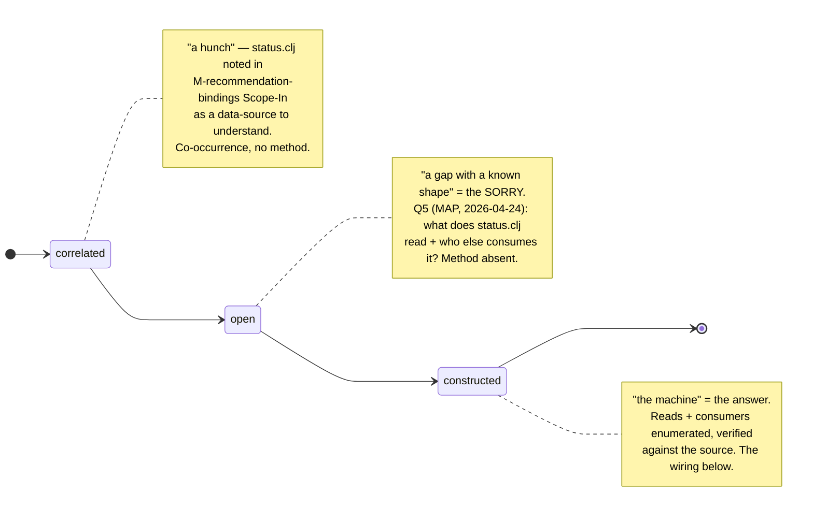
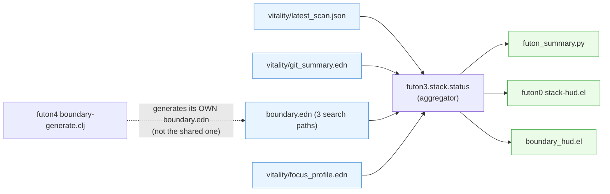

# Closure Lab Note 01 — `recommendation-bindings/q5`

**Hole:** `recommendation-bindings/q5-futon3-src-futon3-stack-status-clj-reads-other-consumers`
**Closed:** recorded 2026-06-10 (construction dated 2026-04-24) · **by** claude-3 (E-ground-G batch)
**Provenance:** `futon5a/holes/missions/M-recommendation-bindings.md:447–465` @ `78d98fd`
**Track-record entry:** `futon6/holes/closure-ledger.edn` (1/N)
**Character:** *already-constructed* (snapshot mislabel — see finding) · codebase-investigation closure

> Purpose of this note: make the steppable evidence **visible** (cascade → sorry → wiring diagram)
> so it can be critiqued by Joe and Fable, not just parsed.

---

## The three-state maturation (the steppable evidence)

A closure is one arrow-type, keyed by its `(have, want)` endpoints, stepping through three states.
This is the M-memes-arrows shape (`reference-case-one-arrow-three-stages.edn`).

The arrow's endpoints are unchanged across all three states — it **matured in place**, it was not
re-minted. That is the token-identity proof.

---

## The wiring diagram (the `:constructed` state)

What "the answer" actually *is*, as a diagram: `futon3.stack.status` is a **read-only aggregator** —
four data sources in, a status report out, consumed by four surfaces. No `ns`-level consumers (it is
a top-level aggregator, not imported as a library).

**Critical surprise (recorded in the construction):** `devmap_readiness.py` tracks per-prototype
data internally but `to_edn()` serializes only per-futon aggregates — so per-prototype entries do
**not** exist in `boundary.edn`. The recommendation-bindings mission's "`:serves-spine` on prototypes"
therefore needs the Python emitter extended first. (This is the kind of thing a wiring diagram makes
visible: the binding target the mission wants isn't in the data yet.)

---

## The cascade (`:correlated` stage) — thin, and that's a data point

For *this* closure the cascade is shallow: the `:correlated` stage was a single rationale-hunch (the
mission naming status.clj as worth understanding), **not** a rich pattern co-occurrence. Not every
closure has a deep cascade — and noticing that is itself part of looking at closures qualitatively.
(Contrast: a forward `kit-outbox`-style closure will have a real cascade — three working pieces that
co-occur before they're wired.)

---

## Finding (why this closure mattered beyond itself)

When I went to close Q5, **it was already constructed** — fully answered 2026-04-24 — yet the
substrate snapshot (`diffsub-scopes.json`) labels its scope `:detached` (open). **The snapshot is
stale.** This:
1. explains the earlier degenerate "all 44 detached" result (E-ground-G v0 attempt), and
2. corrects the grounding design: the realized-closure signal must be **doc/commit-anchored**, not
   read from the snapshot — the snapshot mislabels closed holes as open.

---

## Critique surface (for Joe / Fable)

- Is "read-only aggregator, zero ns-consumers" the right characterization, or is there a runtime/API
  consumer the `ns`-grep missed? (I checked `ns`-requires only.)
- Is recording an *already-done* closure legitimate for "a real track record"? It carries real
  provenance (not made-up), but it is retrospective, not forward. The next closure will be forward
  (genuinely-open hole) for contrast.
- Does the three-state shape *fit* an investigation-closure, or is it being forced? (The `:correlated`
  stage is thin here.)
