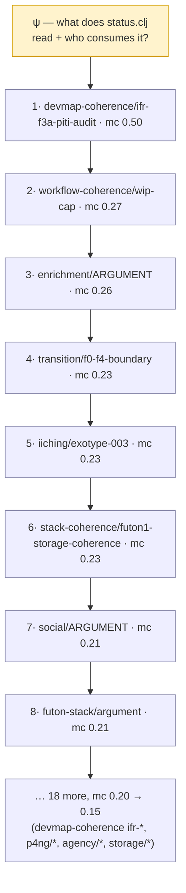
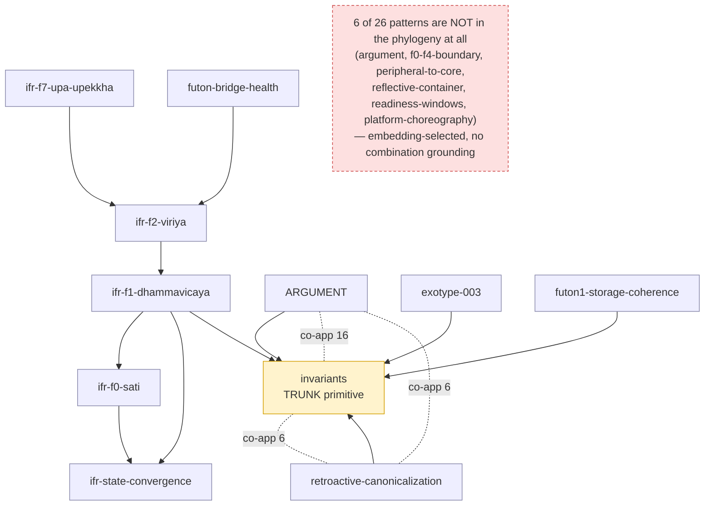
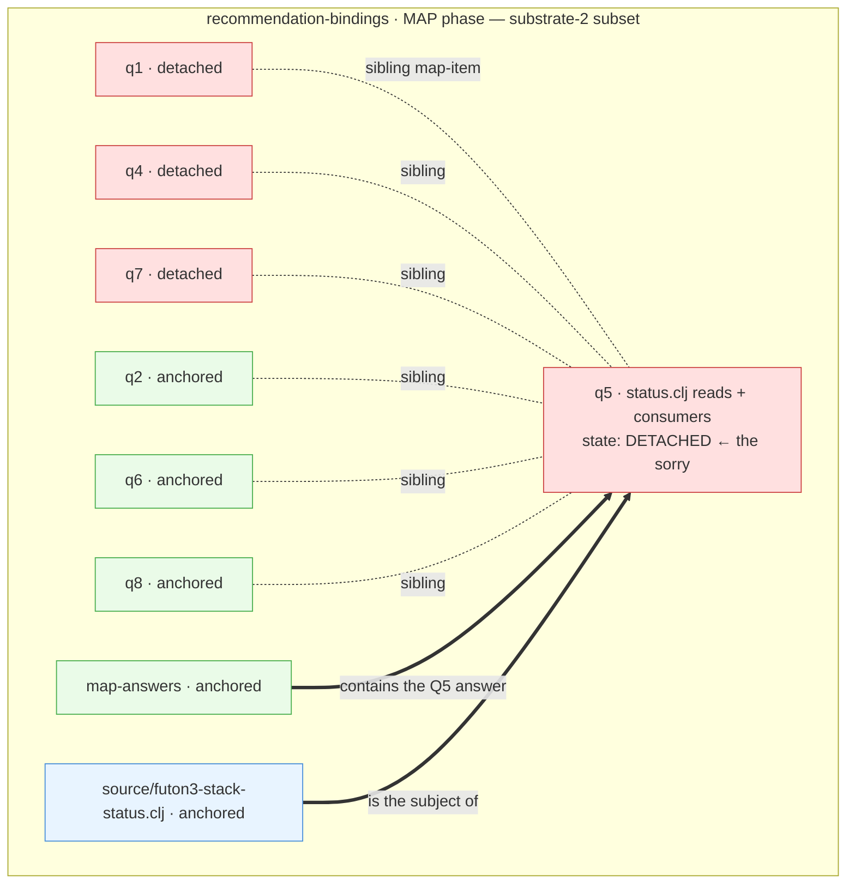
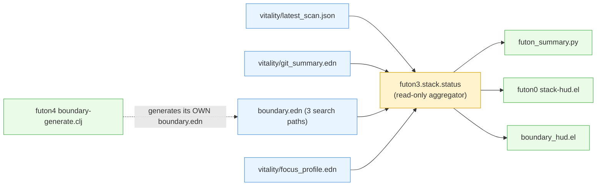
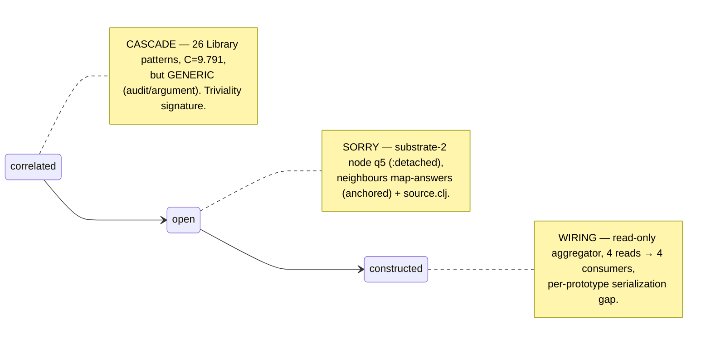
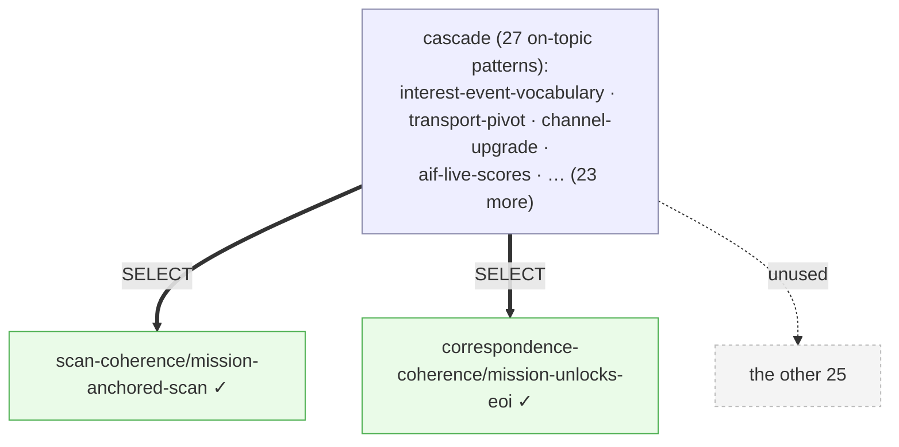
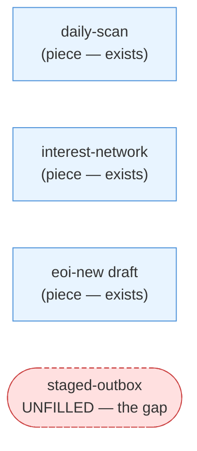
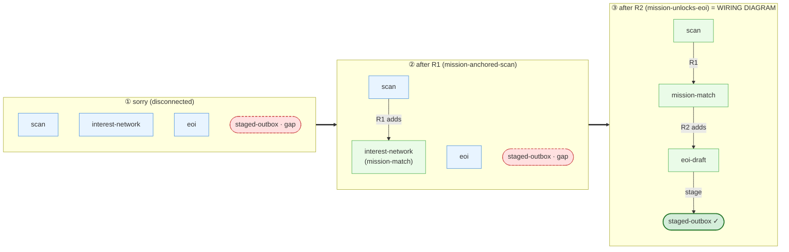
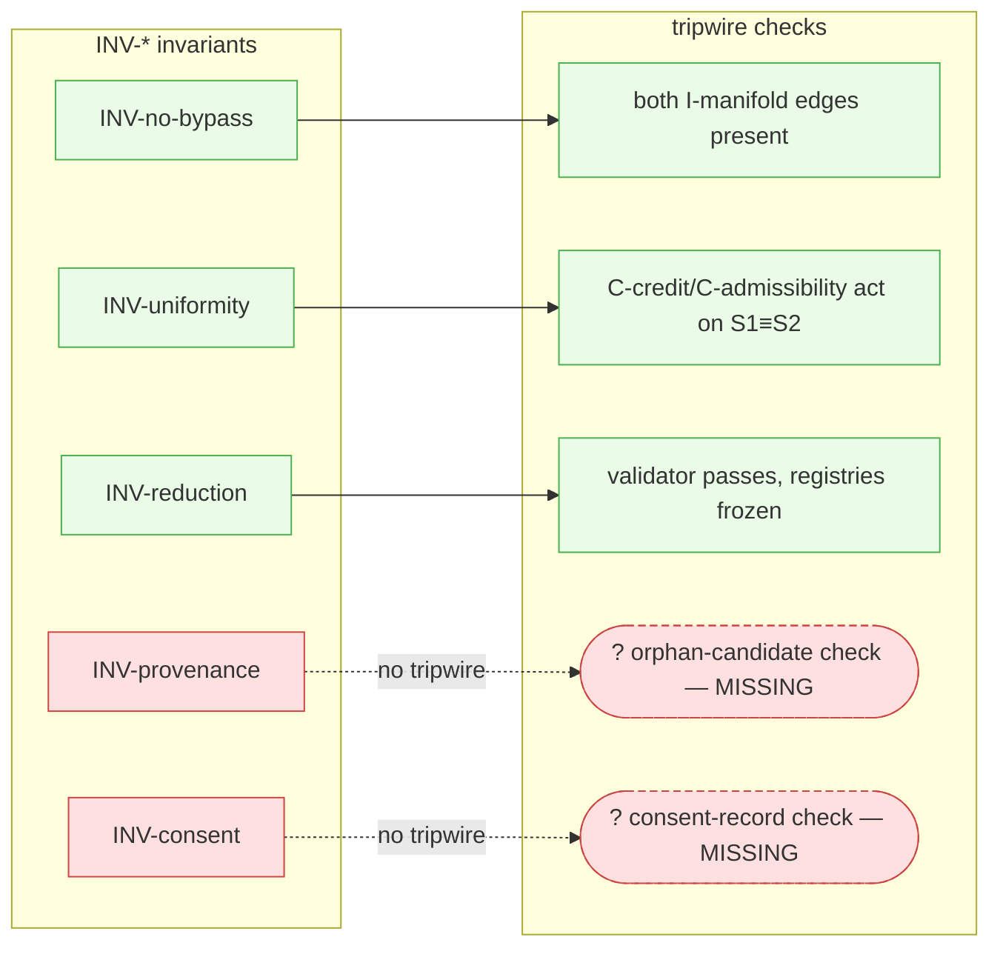
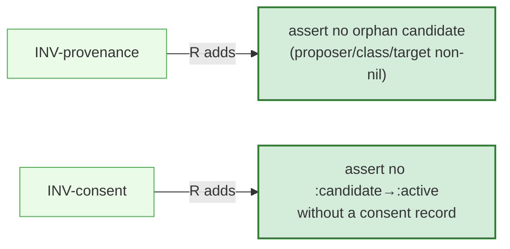

# Early Closures — Lab Note (E-ground-G)

*One note, all early closures inline with diagrams, so each can be inspected properly (in
gh gfm-preview) before moving to the next. Anchored in **patterns** (the cascade) and
**substrate-2** (the sorry) — per Joe, 2026-06-10: if all we learn is "Claude fixes easy things,"
that is not interesting. Each closure shows the M-memes-arrows three states:*

| state | what it is here | source |
|---|---|---|
| **cascade** (`:correlated`) | the real pattern-language `construct_cascade(ψ)` assembles from the Pattern Library to address the hole | `futon3a holes/labs/M-memes-arrows/cascade_construct.py` (MiniLM + posteriors) |
| **sorry** (`:open`) | the hole as a **subset of substrate-2** — the scope + its neighbours | `diffsub-scopes.json` (7071 snapshot) |
| **wiring diagram** (`:constructed`) | the runnable construction that fills the hole | the actual artifact + commit |

Track-record entries: `futon6/holes/closure-ledger.edn`.

---

# Closure 01 — `recommendation-bindings/q5`

**Hole:** `recommendation-bindings/q5-futon3-src-futon3-stack-status-clj-reads-other-consumers`
**Character:** already-constructed (snapshot mislabel) · codebase-investigation · *an "easy" hole — kept deliberately as the contrast case*
**Provenance:** `futon5a/holes/missions/M-recommendation-bindings.md:447–465` @ `78d98fd`

## Stage 1 — the cascade (real pattern-language from the Library)

`construct_cascade(ψ="what does status.clj read + who consumes it", ε=0.15)` → **26 patterns**,
**C=9.791** (T=10.643 × H=0.920). High C — but look at *what* it assembled (top 8 of 26):

**↑ This chain is an embedding artifact, NOT real structure.** `construct_cascade` ranks by MiniLM
cosine only (`cascade_construct.py` lines 65/94/104) and **never reads the 2,538-edge pattern
phylogeny** (`futon6/scripts/pattern_phylogeny.py`: *descent* = cross-reference toward primitives,
*co-application* = HGT roads from co-occurrence in missions). Overlaying the phylogeny on the **same**
patterns recovers the structure it discarded — **14 descent + 10 co-application edges = a semi-lattice**:

*Solid = descent (toward the `invariants` trunk; the `ifr-*` chain sati ← dhammavicaya ← viriya ←
upa-upekkha); dotted = co-application roads. This is "A City is Not a Tree" — tree + cross-links.*

**Three findings:**
1. **The embedding over-selects** — 6/26 patterns have no phylogeny node, so they cannot be part of a
   real pattern-language; they are cosine-neighbours, not combiners.
2. **The cascade machinery is defective** — `construct_cascade` ignores its own combination prior (the
   phylogeny). This *is* the semilattice-vs-linear tension (E4) the campaign already named, found in the
   wild. A phylogeny-grounded cascade would be structured by construction.
3. **C ≠ meaningfulness** — the trivial hole scored *higher* C (9.79) than the meaningful `kit-outbox`
   (7.34), with blander patterns. The "Claude-fixes-easy-things" signature, measurable.

## Stage 2 — the sorry (a real subset of substrate-2)

The hole is **not** a noted gap — it is a node in substrate-2, in the recommendation-bindings MAP
cluster (72 scopes total; the relevant neighbourhood shown). Crucially its neighbours reveal the
construction context: `map-answers` (anchored — *contains the answer*) and the source file scope
(anchored — *the subject*) sit right next to the `:detached` q5.

**The snapshot-stale finding, made structural:** q5 is `:detached` (open) yet `map-answers` —
its own anchored neighbour — *already holds the answer*. The substrate snapshot mislabels a closed
hole as open. **This is why `G` cannot be grounded in the snapshot; the realized-closure signal must
be doc/commit-anchored.** (This is the single most important thing closure 01 taught us.)

## Stage 3 — the wiring diagram (the construction)

What `:constructed` actually *is*: `futon3.stack.status` is a read-only aggregator — four data
sources in, one report out, four consumer surfaces, **zero `ns`-consumers**.

**Critical surprise (in the construction):** `devmap_readiness.py` serializes only per-futon
aggregates — per-prototype entries do **not** exist in `boundary.edn`, so the mission's
`:serves-spine`-on-prototypes binding needs the Python emitter extended first. *The wiring diagram
makes visible that the binding target isn't in the data yet.*

## The three states, end to end

## Findings from closure 01

1. **Snapshot is stale** — `:detached` q5 already had its answer in the anchored `map-answers`
   neighbour. → ground `G` from doc/commit, not the snapshot. (Confirms + explains the E-ground-G v0
   degenerate-all-detached result.)
2. **C ≠ meaningfulness** — the trivial hole's cascade scored *higher* C with blander patterns than
   the meaningful `kit-outbox` hole. The cascade machinery discriminates topicality, not quality.

## Critique surface (Joe / Fable)

- Is the cascade *for this hole* even legitimate evidence, given the hole is an already-closed
  investigation? (It is the contrast case on purpose — the *next* closure is forward + meaningful.)
- The cascade is MiniLM-embedding-driven; the generic-pattern result may be an embedding artifact,
  not a property of the hole. Worth a BGE re-embed (cf. superpod-embeddings) before trusting cascades
  as a signal.
- Is "substrate-2 subset = the diffsub-scopes snapshot neighbourhood" the right cut, or do you want
  the live 7071 hyperedge relations (the actual arrows, not just sibling scopes)?

---

> **Next:** Closure 02 will be a **forward, meaningful** hole (`kit-outbox` or
> `structure-seed-promotion/what-the-poc-does-not-ship`) — a real cascade → sorry → wiring with an
> on-topic pattern-language, to compare against this already-done easy one.

---

# How the inference works (cascade → sorry → wiring as a *process*)

The three stages are not a slideshow; they are a **graph-transformation** ("poor man's protein
folding", Joe). The cascade proposes candidate design-patterns; we **select the subset** actually
needed (often 1–2); each selected pattern is a **graph-rewrite rule** (its `THEN` clause = LHS→RHS)
that acts on the **topology of the sorry**; applying the rules **folds** the sorry-graph into the
wiring diagram. *Learning is "which patterns fold which sorry-topologies into which constructions."*

---

# Closure 02 — `kit-outbox` (forward, meaningful) — a worked fold

**Hole:** `kit-outbox` (`:held` island) — wire daily-scan → interest-network → eoi-new into a staged
outbox; clears T2.2. **Character:** forward · commercial · the construction is the fold's output.

## Stage 1 — cascade, then select the subset

`construct_cascade("staged outbox … cold EOI …")` → 27 patterns, C=7.34, **on-topic** (unlike Q5).
We do **not** use all 27 — we select the two whose rules actually wire the topology:

## Stage 2 — the sorry topology (the unfolded substrate)

Three real pieces exist but are **disconnected**; the target node is **unfilled** — that disconnection
*is* the sorry:

## Stage 3 — the rules (patterns as graph-rewrites; `THEN` = LHS→RHS)

| rule | pattern | LHS (matches) | RHS (rewrites) |
|---|---|---|---|
| **R1** | `mission-anchored-scan` | a free scan + a mission with a question | **add edge** `scan → mission-question` (the scan now *answers* a mission) |
| **R2** | `mission-unlocks-eoi` | a mission producing a showable artefact + a cold EoI | **add first-class edge** `mission-match → eoi-draft`, gated on the artefact |

## Stage 4 — the fold (apply the rules → the wiring diagram)

**The fold yields the wiring diagram** `scan → mission-match → eoi-draft → staged-outbox` — and it is
*forced* by the two rules acting on the topology, not hand-drawn. The construction (the buildable
pipeline) **is** this output graph. Two patterns out of 27; each one an edge-adding rewrite; the gap
node filled. That is the closure, mechanically.

## What this buys us (vs "Claude wired some pieces")

- The **subset selection** is visible and small (2/27) — and *why* those two (their `THEN` clauses are
  the only ones that add the needed edges).
- The **wiring diagram is derived**, not asserted — it is the fixed point of applying the selected
  rules to the sorry topology.
- The **learning signal** is now meaningful and pattern-anchored: *rule R1+R2 close a
  disconnected-pipeline topology*. That generalises to any sorry with the same shape — which is what
  makes it worth grounding `G` in.

## Critique surface (Joe / Fable)

- Are R1/R2 *faithful* rewrites of those patterns' `THEN` clauses, or am I reading wiring into prose?
- Is "disconnected pieces + unfilled target" the right formal shape for a sorry topology, or should it
  use the existing `strategic-sorry-topology.aif.edn` / `alignment.edn` representation verbatim?
- The fold here is hand-applied. To be a real process it wants an *engine* (apply rule-set to a
  topology → fixed point). futon5 `tpg/runner` + `aif2-exotype` wiring may already be that engine —
  worth wiring the fold to it rather than drawing it.

---

# Closure 03 — `aif2/inv-tripwire-mapping` (a mapping fold; cascade-miss data point)

**Hole:** map each aif2 `INV-*` invariant to its checkable **tripwire** (detector). **Character:**
forward · mapping (bipartite) · *the cascade misses it — a contrast to kit-outbox*.

## Stage 1 — cascade (small, low-C, NO phylogeny structure)

`construct_cascade` → **8 patterns, C=1.841** (vs 27 / 7.34 for kit-outbox). The top pattern is
on-topic (`futon-theory/structural-tension-as-observation` — an INV *is* a structural tension; and
`sidecar/typed-kolmogorov-arrows` — the mapping arrow), but **the phylogeny shows 0 descent edges
and 1 co-application edge among them** — they do **not** combine into a pattern-language.

> **Finding (new kind):** here the *hole folds cleanly but the cascade fails to surface its
> pattern-language*. So "the hole is foldable" and "the cascade found the right patterns" are
> **independent** — the embedding-only cascade can miss a well-formed hole. (kit-outbox: cascade hit;
> inv-tripwire: cascade miss; same fold-discipline applies to both.) Another nail in
> "ground the cascade in the phylogeny, not just the embedding."

## Stage 2 — the sorry topology (a bipartite mapping with 2 missing edges)

Five `INV-*` invariants; three already have a tripwire (M-aif2.md:294); **two are unmapped — the gap:**

## Stage 3 — the rule (typed-arrow), and the fold

**R (`sidecar/typed-kolmogorov-arrows`):** for an invariant `I` stated as a proposition, **add a
typed arrow** `I → check(I)` where `check(I)` is the structural test that *fails iff `I` is violated*.
Applied to the two unmapped invariants (read off their statements):

| INV | statement | derived tripwire `check(I)` |
|---|---|---|
| `INV-provenance` | every candidate carries `{proposer-id, action-class, target}` | **assert no candidate has a nil proposer-id/action-class/target** (no orphans) |
| `INV-consent` | activating a `:candidate` is consent-gated | **assert no `:candidate` reaches `:active` without a consent record** in its provenance |

**The fold yields the wiring diagram** = the complete bipartite `INV-* ↔ tripwire` mapping (5/5). The
two derived checks are the construction; landing them as tests in M-aif2.md is the realization
(flagged for the aif2 owner to ratify — I do not silently edit another mission's doc).

## Critique surface
- Are the two derived tripwires *faithful* to the invariant statements, or under-specified? (They are
  the minimal structural tests; the aif2 owner should confirm completeness.)
- The cascade-miss is the headline: should `construct_cascade` be phylogeny-grounded **before** we use
  cascades as any kind of signal? (Same conclusion as Closure 01, now from the opposite direction.)
