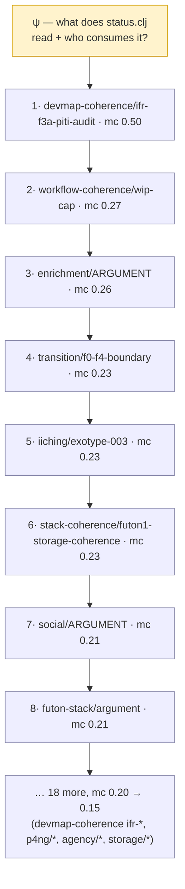
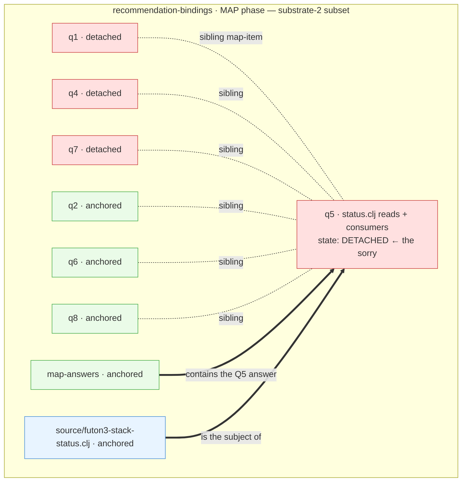
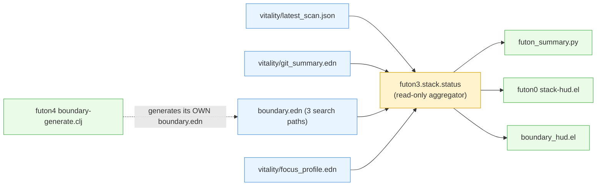
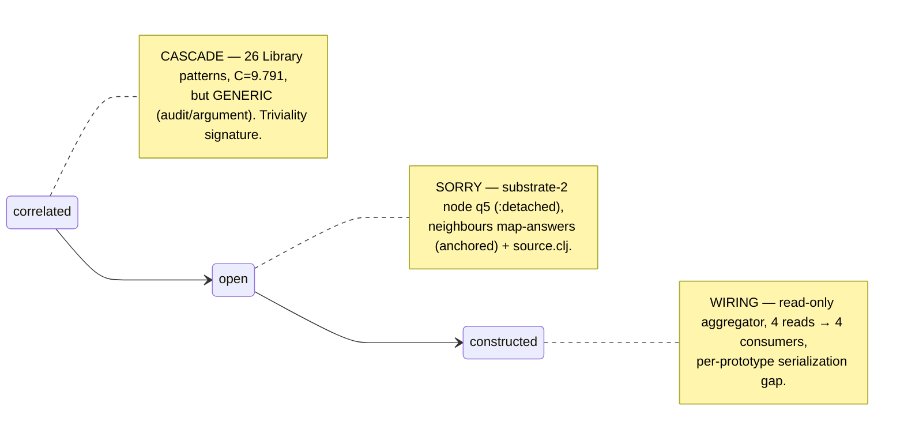

# Early Closures — Lab Note (E-ground-G)

*One note, all early closures inline with diagrams, so each can be inspected properly (in
gh gfm-preview) before moving to the next. Anchored in **patterns** (the cascade) and
**substrate-2** (the sorry) — per Joe, 2026-06-10: if all we learn is "Claude fixes easy things,"
that is not interesting. Each closure shows the M-memes-arrows three states:*

| state | what it is here | source |
|---|---|---|
| **cascade** (`:correlated`) | the real pattern-language `construct_cascade(ψ)` assembles from the Pattern Library to address the hole | `futon3a holes/labs/M-memes-arrows/cascade_construct.py` (MiniLM + posteriors) |
| **sorry** (`:open`) | the hole as a **subset of substrate-2** — the scope + its neighbours | `diffsub-scopes.json` (7071 snapshot) |
| **wiring diagram** (`:constructed`) | the runnable construction that fills the hole | the actual artifact + commit |

Track-record entries: `futon6/holes/closure-ledger.edn`.

---

# Closure 01 — `recommendation-bindings/q5`

**Hole:** `recommendation-bindings/q5-futon3-src-futon3-stack-status-clj-reads-other-consumers`
**Character:** already-constructed (snapshot mislabel) · codebase-investigation · *an "easy" hole — kept deliberately as the contrast case*
**Provenance:** `futon5a/holes/missions/M-recommendation-bindings.md:447–465` @ `78d98fd`

## Stage 1 — the cascade (real pattern-language from the Library)

`construct_cascade(ψ="what does status.clj read + who consumes it", ε=0.15)` → **26 patterns**,
**C=9.791** (T=10.643 × H=0.920). High C — but look at *what* it assembled (top 8 of 26):

**Observation (a real finding, not a footnote):** this cascade is **high-C but generic** —
`*/ARGUMENT`, `*/argument`, `devmap-coherence/*`, `workflow-coherence/wip-cap`. It is the *coherence
of an audit*, not of a specific construction. Compare `kit-outbox` (a meaningful hole), whose cascade
scores **lower C (7.34)** but assembles *on-topic* patterns (`structure/interest-event-vocabulary`,
`scan-coherence/mission-anchored-scan`, `correspondence-coherence/mission-unlocks-eoi`). So **`C`
(wholeness) does not track meaningfulness** — the trivial hole scored *higher*. This is the
"Claude-fixes-easy-things" signature made measurable, and it echoes the known MiniLM-cosine-artifact
problem. *The cascade machinery is more useful as a topicality/triviality discriminator than as a
quality score.*

## Stage 2 — the sorry (a real subset of substrate-2)

The hole is **not** a noted gap — it is a node in substrate-2, in the recommendation-bindings MAP
cluster (72 scopes total; the relevant neighbourhood shown). Crucially its neighbours reveal the
construction context: `map-answers` (anchored — *contains the answer*) and the source file scope
(anchored — *the subject*) sit right next to the `:detached` q5.

**The snapshot-stale finding, made structural:** q5 is `:detached` (open) yet `map-answers` —
its own anchored neighbour — *already holds the answer*. The substrate snapshot mislabels a closed
hole as open. **This is why `G` cannot be grounded in the snapshot; the realized-closure signal must
be doc/commit-anchored.** (This is the single most important thing closure 01 taught us.)

## Stage 3 — the wiring diagram (the construction)

What `:constructed` actually *is*: `futon3.stack.status` is a read-only aggregator — four data
sources in, one report out, four consumer surfaces, **zero `ns`-consumers**.

**Critical surprise (in the construction):** `devmap_readiness.py` serializes only per-futon
aggregates — per-prototype entries do **not** exist in `boundary.edn`, so the mission's
`:serves-spine`-on-prototypes binding needs the Python emitter extended first. *The wiring diagram
makes visible that the binding target isn't in the data yet.*

## The three states, end to end

## Findings from closure 01

1. **Snapshot is stale** — `:detached` q5 already had its answer in the anchored `map-answers`
   neighbour. → ground `G` from doc/commit, not the snapshot. (Confirms + explains the E-ground-G v0
   degenerate-all-detached result.)
2. **C ≠ meaningfulness** — the trivial hole's cascade scored *higher* C with blander patterns than
   the meaningful `kit-outbox` hole. The cascade machinery discriminates topicality, not quality.

## Critique surface (Joe / Fable)

- Is the cascade *for this hole* even legitimate evidence, given the hole is an already-closed
  investigation? (It is the contrast case on purpose — the *next* closure is forward + meaningful.)
- The cascade is MiniLM-embedding-driven; the generic-pattern result may be an embedding artifact,
  not a property of the hole. Worth a BGE re-embed (cf. superpod-embeddings) before trusting cascades
  as a signal.
- Is "substrate-2 subset = the diffsub-scopes snapshot neighbourhood" the right cut, or do you want
  the live 7071 hyperedge relations (the actual arrows, not just sibling scopes)?

---

> **Next:** Closure 02 will be a **forward, meaningful** hole (`kit-outbox` or
> `structure-seed-promotion/what-the-poc-does-not-ship`) — a real cascade → sorry → wiring with an
> on-topic pattern-language, to compare against this already-done easy one.
